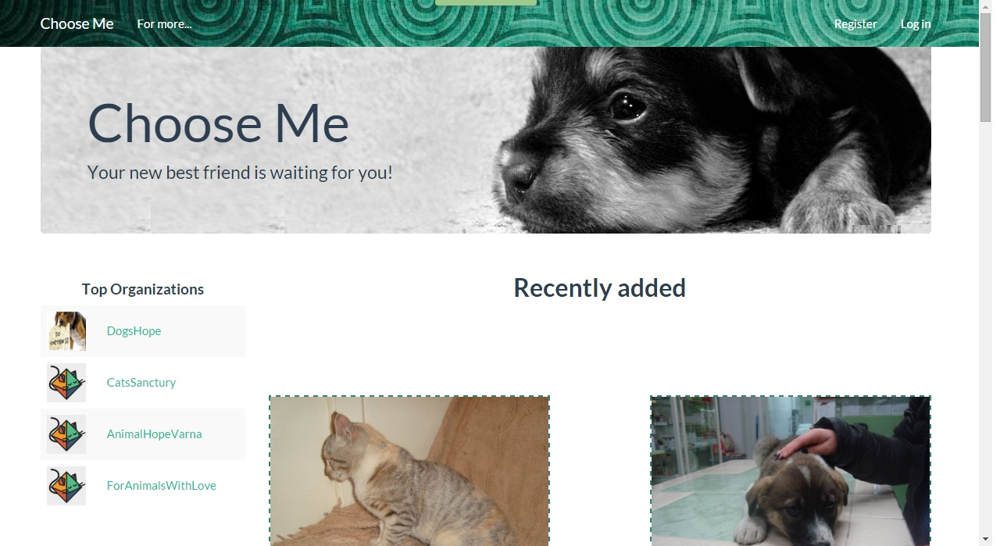
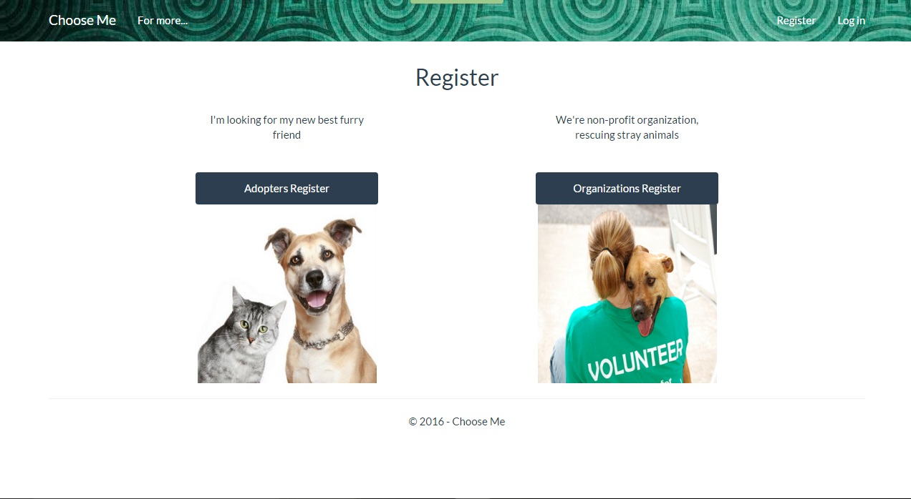
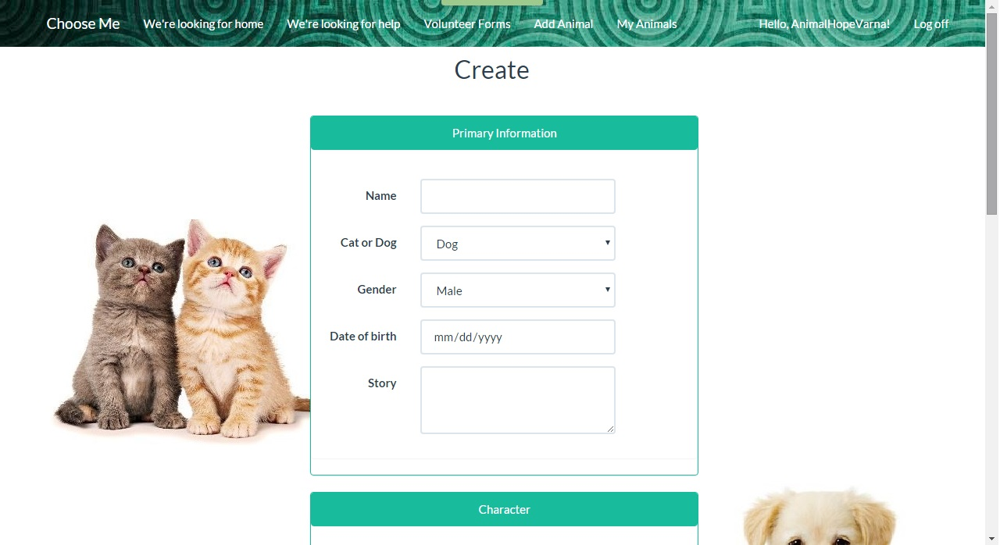
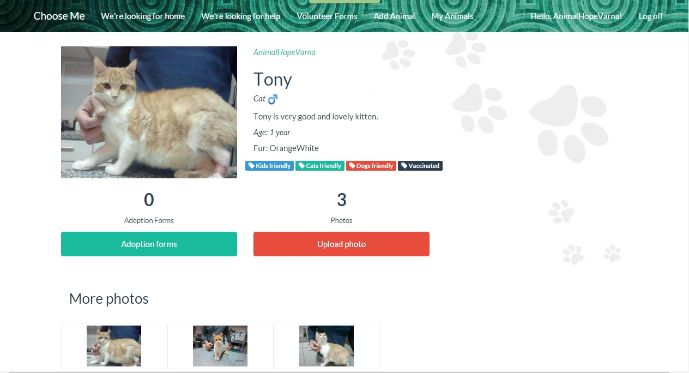
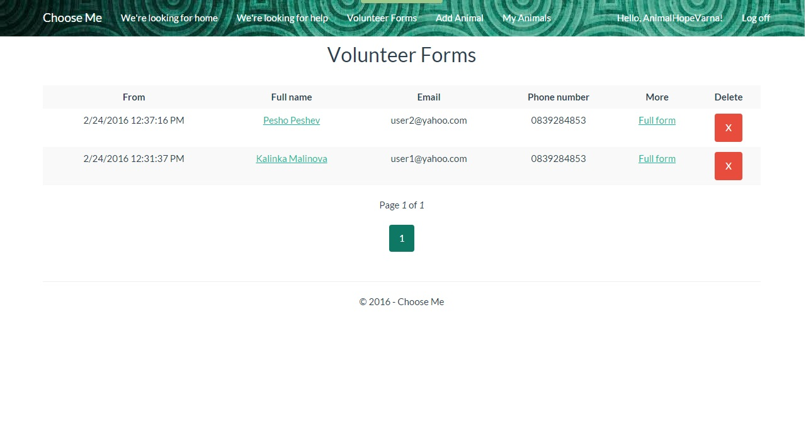

<h2>Choose Me/ASP.NET MVC Project</h2>

Choose me is developed to provide an opportunity for organizations, who are rescuing homeless animals, to present their rescued to people, who are looking for new pet or way to help to the stray animals. Here people can applay for volunteers and organization to find help for their cause.

 
<h3>Description</h3>

The application has privete and public part: 

<ol>
<li>
<strong>Public part: </strong> Here not logged users can see the last five added cats and dogs, and top 10 organizations, based on number of animals they take care of. 
</li>
<li>
<strong>Private part: </strong>
<ul>
<li>
Common private part: Can be seen from any registrated user. Contains list of all organizations, animals and detail view of the organizations and animals.
</li>
<li>
Admin private part: Can be seen only by users with role Admin. Contains list of all users, forms and animals. The Admin can delete any of mentioned before.
</li>
<li>
Organization private part: Can be seen only by users with role Organization. Here organizations can see recieved adoption and volunteer forms. And can create new animals.
</li>
<li>
Adopter private part: Can be seen only by users with role Adopter. Here Adopters can see the forms they have sent.
</li>
</ul>
</li>
</ol>

<ul>
<li>
All input field have client-side and server-side validation and appropriate error or success messages are displayed to the user
</li>
<li>
File upload of a animal photo is available for the organization creator.
</li>
<li>
Registration of users in different roles is available
</li>
</ul>
<h3>Usage of Kendo UI for ASP.NET MVC</h3>

The lib is on trial version and it is not legal to use it unless purchased or also downloaded as trial <a href="http://www.telerik.com/kendo-ui">Kend UI</a>

Screenshots:

